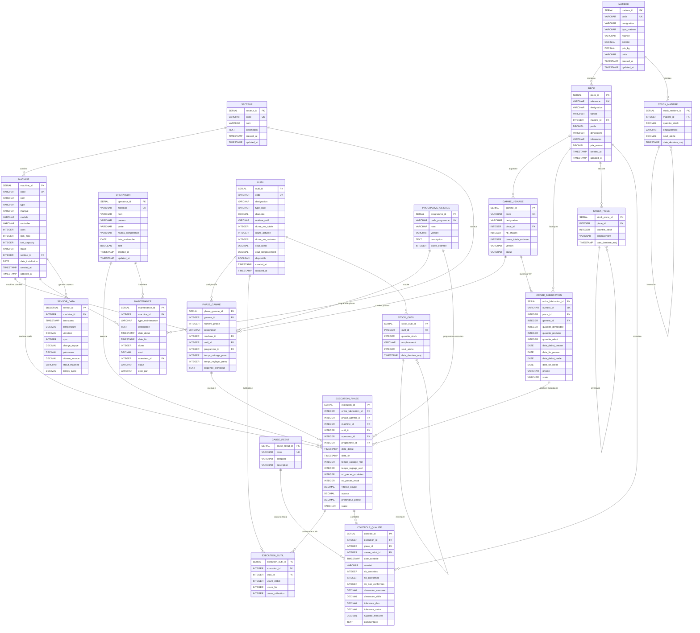

# AMIP - ER Diagram

## Entity Relationship Diagram



## Data Flow Diagram

```
┌─────────────┐     ┌──────────────┐     ┌───────────────┐
│  SECTEUR    │────>│   MACHINE    │────>│ SENSOR_DATA   │
└─────────────┘     └──────┬───────┘     └───────────────┘
                           │
                           │
┌─────────────┐     ┌──────┴───────┐     ┌───────────────┐
│  OPERATEUR  │────>│ EXECUTION    │────>│CONTROLE       │
└─────────────┘     │ _PHASE       │     │_QUALITE       │
                    └──────┬───────┘     └───────────────┘
                           │
                    ┌──────┴───────┐
                    │EXECUTION     │
                    │_OUTIL        │
                    └──────────────┘

┌─────────────┐     ┌──────────────┐     ┌───────────────┐
│  MATIERE    │────>│    PIECE     │────>│GAMME_USINAGE  │
└─────────────┘     └──────┬───────┘     └───────┬───────┘
                           │                     │
                    ┌──────┴───────┐     ┌───────┴───────┐
                    │ORDRE_FABRIF. │     │ PHASE_GAMME   │
                    └──────────────┘     └───────────────┘

┌─────────────┐     ┌──────────────┐
│    OUTIL    │────>│ STOCK_OUTIL  │
└─────────────┘     └──────────────┘
```

## Dependency Order (Generation)

```
1. SECTEUR
2. MACHINE (depends on SECTEUR)
3. OPERATEUR
4. MATIERE
5. OUTIL
6. STOCK_OUTIL (depends on OUTIL)
7. PIECE (depends on MATIERE)
8. PROGRAMME_USINAGE
9. GAMME_USINAGE (depends on PIECE)
10. PHASE_GAMME (depends on GAMME, MACHINE, OUTIL, PROGRAMME)
11. ORDRE_FABRICATION (depends on PIECE, GAMME)
12. EXECUTION_PHASE (depends on OF, PHASE_GAMME, MACHINE, OUTIL, OPERATEUR)
13. EXECUTION_OUTIL (depends on EXECUTION, OUTIL)
14. CAUSE_REBUT
15. CONTROLE_QUALITE (depends on EXECUTION, PIECE, CAUSE_REBUT)
16. MAINTENANCE (depends on MACHINE, OPERATEUR)
17. SENSOR_DATA (depends on MACHINE)
18. STOCK_PIECE (depends on PIECE)
19. STOCK_MATIERE (depends on MATIERE)
```
